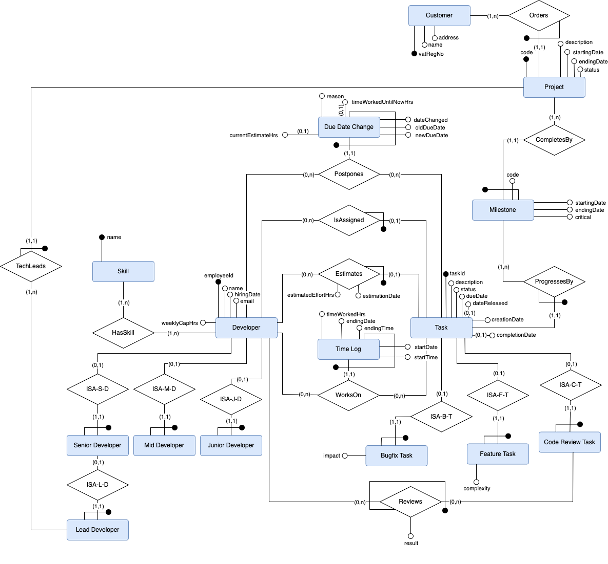

# Fabio Vitalba - Project Task management for IT Company
This is the final project for the course "Introduction to Databases 24/25" for Fabio Vitalba.

## Project Task management for IT Company
This Project is divided into two parts:
- One SQL script to initialize a Database including constraints and some sample data
- One Java Terminal Application that allows the user to work with the database through some interaction.

## 1. Description
The Project is described through the included documentation that you can find here:
- [Project Specification (PDF)](./Documentation/IntroToDB-ProjectSpecification.pdf)
- 
- 

## 2. Installation
- The SQL script is a PostgreSQL SQL script and as such must be executed on a PostgreSQL database. ATTENTION! The script deletes the tables if found, so you will lose data if executed without caution.

- The Java Application can be run using java JDK. You likely need to have a valid PostgreSQL package in your classpath in order for it to function properly. You can download the PostgreSQL package from [here](https://jdbc.postgresql.org/download/) and put it into the `./IntroToDB/packages` folder. If it still does not work, make sure that the package is loaded properly.

