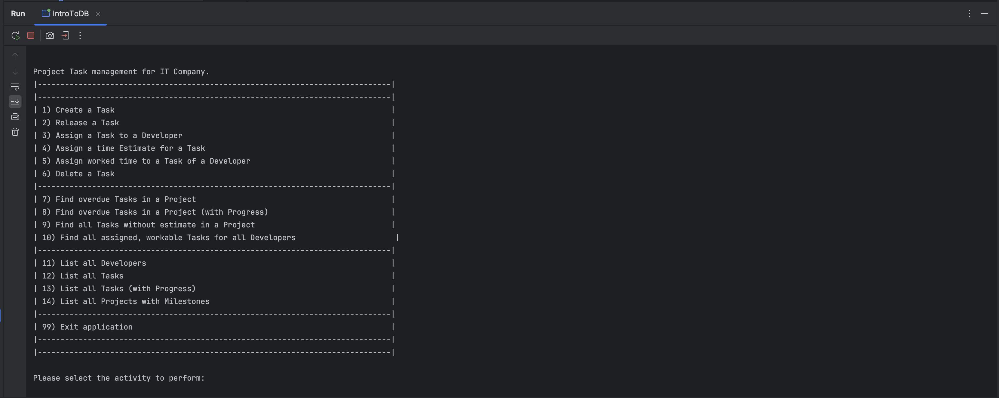

# Fabio Vitalba - Project Task management for IT Company
This is the final project for the course "Introduction to Databases 24/25" for Fabio Vitalba.

## Project Task management for IT Company
This Project is divided into two parts:
- One SQL script to initialize a Database including constraints and some sample data
- One Java Terminal Application that allows the user to work with the database through some interaction.

## 1. Description
The Project is described through the included documentation that you can find here:
- [Project Specification (PDF)](./Documentation/IntroToDB-ProjectSpecification.pdf)

## 2. Visuals
Here are some images of how the application looks like:

## 3. Installation
### Prerequisites
This application requires Java JDK, as well as a PostgreSQL Server running on your machine.

### Installation Notes
- The SQL script is a PostgreSQL SQL script and as such must be executed on a PostgreSQL database. ATTENTION! The script deletes the tables if found, so you will lose data if executed without caution.

- The Java Application can be run using java JDK. 
  - You likely need to have a valid PostgreSQL package in your classpath in order for it to function properly. You can download the PostgreSQL package from [here](https://jdbc.postgresql.org/download/) and put it into the `./IntroToDB/packages` folder. If it still does not work, make sure that the package is loaded properly.
  - You may need to alter the PostgreSQLConnector settings in order to connect to your PostgreSQL instance. You find the class under `./IntroToDB/src/database/PostgreSQLConnector.java`.

## 4. Usage
As you can see from the screenshots above, this application runs in the Terminal.
Follow the installation instructions and run the application locally.

## 5. Known issues
- **Most inputs are not validated before being passed to the SQL Database:** This issue appears in almost all inputs, since most are just taken "as-is" and passed directly to the Query. This results in unwanted behaviour like:
  - If you try to assign a non-existing Task, this will work --> An UPDATE is executed, which will update NO TUPLES, therefore the SQL statement is valid and throws no errors.
- **SQL Database constraints are not updated with latest specification:** After the project discussion on the 18.02.2025 I revisited the requirements and improved the constraints for the Restructured Schema. This led to the introduction of a few new constraints, that are now NOT REPRESENTED in the SQL file in this project.
- **Task Restructuring required:** The Task Table contains many attributes and could probably be improved on. Some examples include:
  - Adding a constraint for completionDate to be `NOT NULL` whenever status = `'completed'`.
  - Adding a constraint for dateReleased to be `NOT NULL` whenever status != `not authorized`.
  - Vertical decomposition of `Task(taskId, description, status, dueDate, dateReleased*, creationDate, completionDate*, project, milestone, assignedDeveloper*)` into `Task(taskId, description status, dueDate, creationDate, project, milestone, assignedDeveloper*)` `TaskStatusDate(taskId,status,date)`. `TaskStatusDate` could then hold the tuple `(status='authorized',dateReleased)` for the release date, as well as the tuple `(status='completed',completionDate)` in order to reduce NULL values in Task and reduce its size. It could also be further optimized by also including the tuple `(status='not authorized',creationdate)` in order to remove another attribute that is rarely used in Task. This requires some restructuring of the Relational Schema, as well as the update of the SQL file in this project.
